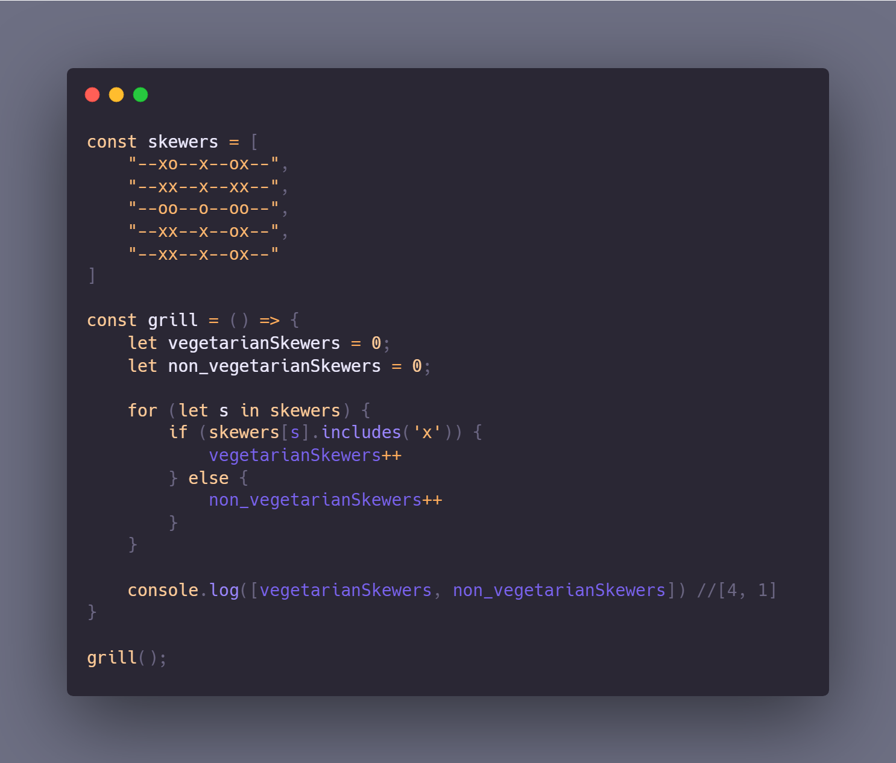

## Challenge 003 - Barbecue Skewers
 
You are in charge of the barbecue grill. A vegetarian skewer is a skewer that has only vegetables (-o). A non-vegetarian skewer is a skewer with at least one piece of meat (-x).

Given a BBQ grill, write a function that returns [# vegetarian skewers, # non-vegetarian skewers]. For example above, the function should return ´[1, 4]´.

