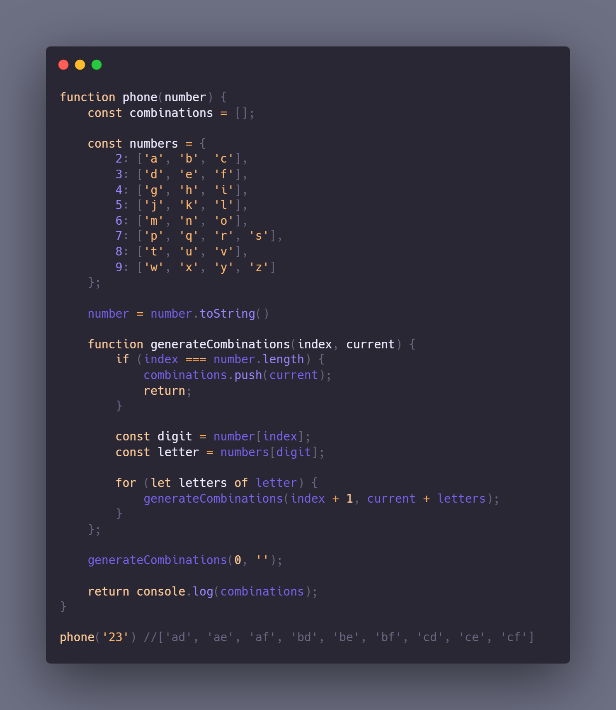

## Challenge 008 - Letter Combinations of a Phone Number
 
Given a string containing digits from 2-9 inclusive, return all possible letter combinations that the number could represent. Return the answer in any order.

