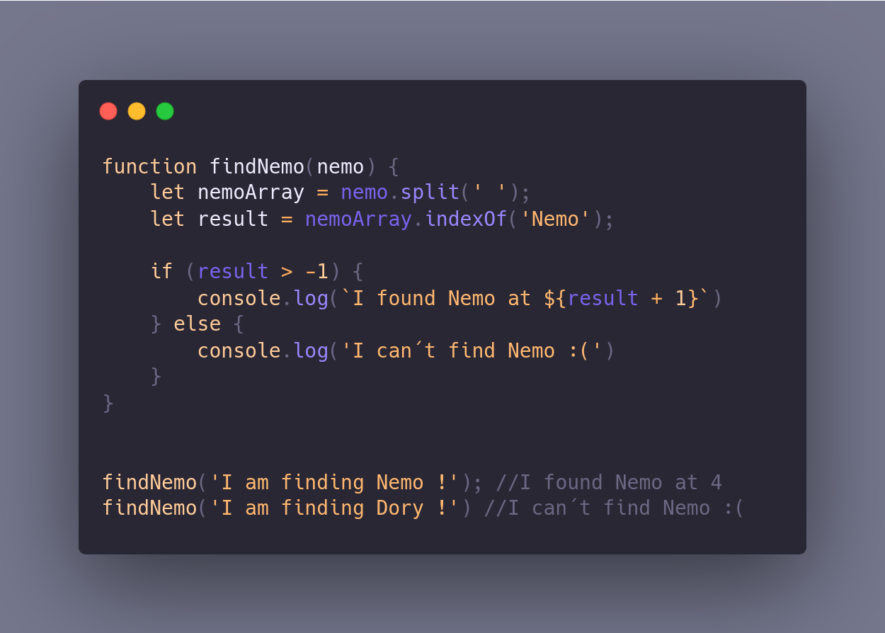

# Desafio 002 - Finding Nemo
## You´re given a string of words. You need to find the word "Nemo", and return a string like this: `I found Nemo at [the order of the word you find nemo]!`. If you can´t'find Nemo, return `I can´t find Nemo :(`.

