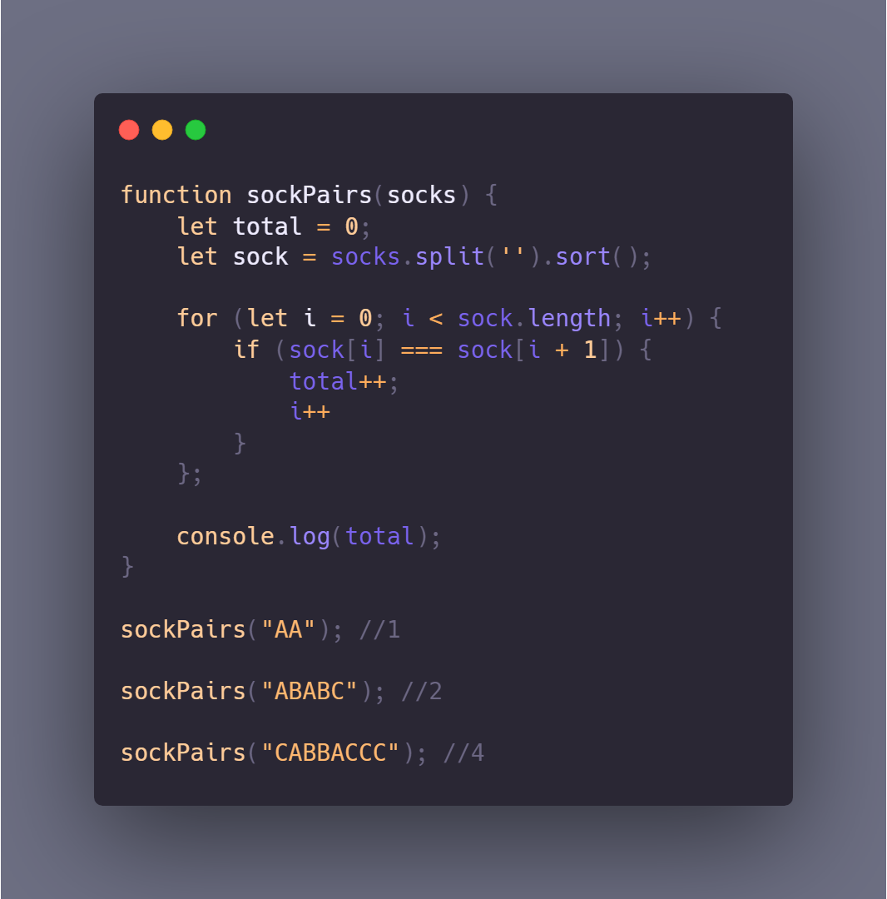

## Challenge 005 - Pair of Socks

Joseph is in the middle of packing for a vacation. He's having a bit of trouble finding all of his socks, though.

Write a function that returns the number of sock pairs he has. A sock pair consists of two of the same letter, such as `"AA"`. The socks are represented as an unordered sequence.

